# Screenshots Directory

This directory contains UI screenshots for documentation purposes.

## Current Screenshots

### login-page.png
**Description**: Login page for the Policy and Event Visualization system
- Shows the authentication interface with username and password fields
- Displays the welcome message and system title
- Used in: OPERATIONS_GUIDE.md

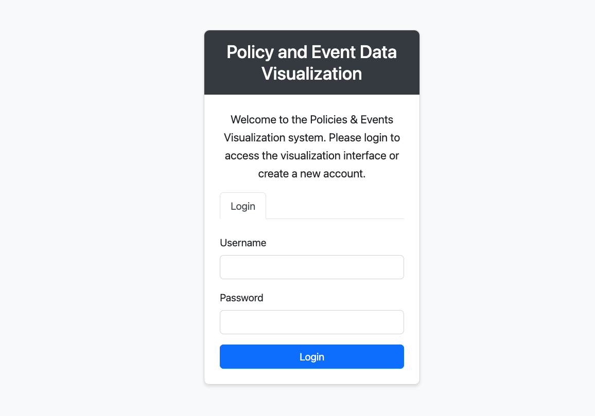

**Features shown**:
- Clean, modern login interface
- Username field (default: admin)
- Password field with visibility toggle
- Login button
- Welcome message explaining the system purpose

### policies-events-viewer.png
**Description**: Main visualization interface showing the complete policy and event analysis view with deployed policies
- Displays the primary working interface after login
- Shows real data with 13,998 policy entries
- All visible policies are deployed (✓ Yes status)
- Used in: OPERATIONS_GUIDE.md, README.md

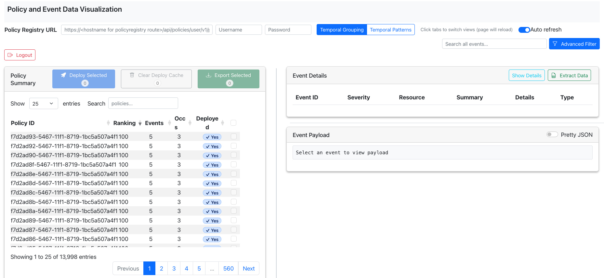

**Features shown**:
- **Policy Summary Table** (left panel):
  - Sortable columns: Policy ID, Ranking, Events, Occurrences (Occs), Deployed status
  - Bulk action buttons: "Deploy Selected (0)", "Clear Deploy Cache (0)", "Export Selected (0)"
  - Pagination controls showing "1 to 25 of 13,998 entries"
  - Row selection checkboxes for batch operations
  - Search functionality for filtering policies
  - Shows deployment status with "✓ Yes" indicators for deployed policies
  - All visible policies have consistent metrics: Ranking=5, Events=3, Occurrences=3
  
- **Event Details Table** (top right panel):
  - Columns: Event ID, Severity, Resource, Summary, Details, Timestamp
  - Search box for filtering events
  - Pagination controls
  - "Show Details" and "Extract Data" action buttons
  
- **Event Payload Viewer** (bottom right panel):
  - JSON payload display for selected events
  - Toggle between Pretty JSON and raw format
  - Placeholder text when no event is selected
  
- **Top Navigation Bar**:
  - Policy Registry URL input field
  - Username and Password authentication fields
  - View switcher tabs: "Temporal Grouping" / "Temporal Patterns"
  - Auto-refresh toggle switch
  - Global event search box
  - Advanced Filter button
  - Logout button

### policies-events-viewer-policyregisteryinfo.png
**Description**: Policy deployment workflow showing Policy Registry API configuration and policy selection
- Demonstrates the complete deployment process with authentication
- Shows 2 policies selected for deployment (Deploy Selected button shows "2")
- Policy Registry URL, username, and password fields are populated
- Used in: OPERATIONS_GUIDE.md

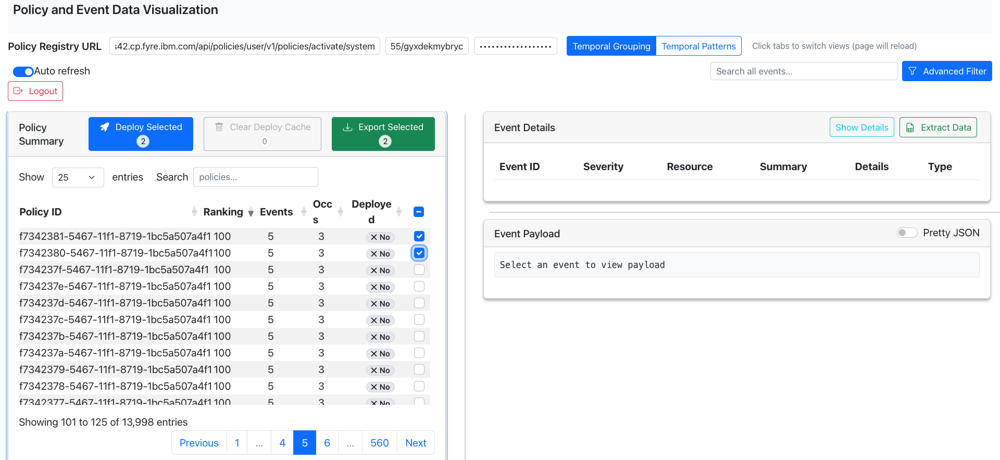

**Features shown**:
- **Policy Registry Configuration** (top navigation):
  - Policy Registry URL field populated with API endpoint
  - Username field filled in (using API key authentication)
  - Password field populated (masked)
  - Ready for policy deployment operations
  
- **Policy Selection for Deployment**:
  - 2 policies selected via checkboxes in the Policy Summary table
  - "Deploy Selected" button shows count: "2" (indicating 2 policies ready to deploy)
  - "Clear Deploy Cache" and "Export Selected" buttons also show "0" count
  
- **Deployment Workflow**:
  - Demonstrates the end-to-end process: configure API → select policies → deploy
  - Shows how API key authentication is used for Policy Registry access
  - Illustrates the batch deployment capability for multiple policies
  
- **All other interface elements**:
  - Policy Summary table with sortable columns
  - Event Details panel (right side)
  - Event Payload viewer (bottom right)
  - View switcher tabs and auto-refresh toggle
  - Search and filter capabilities

### policies-deployment.png
**Description**: Active policy deployment showing real-time progress and success notification
- Captures the deployment process in action with status dialog
- Shows successful deployment of 2 policies to Policy Registry
- Displays deployment progress indicator and next steps
- Used in: OPERATIONS_GUIDE.md

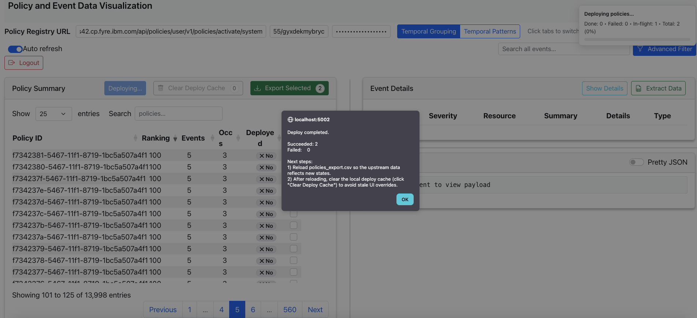

**Features shown**:
- **Deployment Status Dialog** (center overlay):
  - Title: "localhost:5002" (deployment target)
  - Status message: "Deploy completed."
  - Success metrics: "Succeeded: 2, Failed: 0"
  - Next steps instructions:
    1) Reload policies_export.csv for upstream data updates
    2) Clear local deploy cache to avoid stale data overrides
  - "OK" button to dismiss dialog
  
- **Deployment Progress Indicator** (top right):
  - Real-time status: "Deploying policies..."
  - Progress details: "Done: 0 • Failed: 0 • In-flight: 1 • Total: 2 (0%)"
  - Shows deployment is actively processing
  
- **Button States During Deployment**:
  - "Deploying..." button (disabled/grayed out during operation)
  - "Clear Deploy Cache" shows "0" count
  - "Export Selected" shows "2" (the policies being deployed)
  
- **Policy Registry Configuration** (top bar):
  - URL: "i42.cp.fyre.ibm.com/api/policies/user/v1/policies/activate/system"
  - Username: "55/gyxdekmybryc"
  - Password: masked with dots
  - Auto-refresh toggle enabled
  
- **Policy Summary Table**:
  - Shows policies with "✕ No" deployment status (pre-deployment state)
  - Pagination: "Showing 101 to 125 of 13,998 entries"
  - All policies visible have consistent metrics (Ranking=5, Events=3, Occs=3)

**Workflow demonstrated**:
1. User configured Policy Registry credentials
2. Selected 2 policies for deployment
3. Clicked "Deploy Selected" button
4. System is actively deploying policies
5. Success dialog appears showing completion status
6. User can proceed with recommended next steps

### policies-deployment-finished.png
**Description**: Post-deployment state showing successfully deployed policies and cache management
- Shows the final state after successful deployment completion
- 2 policies now display "✓ Yes" deployment status (previously "✕ No")
- Highlights the "Clear Deploy Cache" functionality for cache management
- Used in: OPERATIONS_GUIDE.md

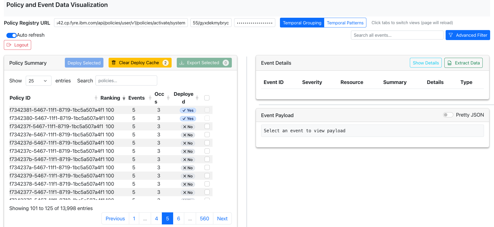

**Features shown**:
- **Deployment Status Changes**:
  - First 2 policies (f7342381, f7342380) now show "✓ Yes" in Deployed column
  - Remaining policies still show "✕ No" (not deployed)
  - Visual confirmation that deployment was successful
  
- **Cache Management Highlighted**:
  - "Clear Deploy Cache" button shows count "2" (in yellow/warning color)
  - Indicates 2 policies are in the local deploy cache
  - Important step to prevent stale data from overriding upstream changes
  - Button is ready to be clicked to clear the cache
  
- **Button States Post-Deployment**:
  - "Deploy Selected" button (blue, ready for next deployment)
  - "Clear Deploy Cache" button (yellow, showing "2" - action needed)
  - "Export Selected" button (green, showing "0")
  
- **Policy Registry Configuration** (still visible):
  - URL: "i42.cp.fyre.ibm.com/api/policies/user/v1/policies/activate/system"
  - Username and password fields populated
  - Auto-refresh toggle enabled
  
- **Policy Summary Table**:
  - Mixed deployment states visible (2 deployed, rest not deployed)
  - Pagination: "Showing 101 to 125 of 13,998 entries"
  - All policies have consistent metrics (Ranking=5, Events=3, Occs=3)

**Post-Deployment Workflow**:
1. ✅ Deployment completed successfully (2 policies deployed)
2. ✅ Deployment status updated in UI (✓ Yes indicators)
3. ⚠️ **Next step**: Click "Clear Deploy Cache" to remove local cache
4. 📋 Optionally: Reload policies_export.csv for upstream data sync

**Key takeaway**: This screenshot demonstrates the importance of cache management after deployment to ensure data consistency between local cache and upstream Policy Registry.

### advanced-filter.png
**Description**: Advanced Filter Builder dialog for creating complex event filtering queries
- Shows the filter builder interface with multiple conditions
- Demonstrates AND/OR logic combination for complex queries
- Includes date picker and operator selection capabilities
- Used in: OPERATIONS_GUIDE.md

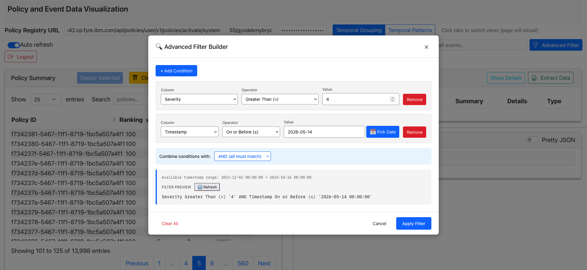

**Features shown**:
- **Filter Builder Dialog** (modal overlay):
  - Title: "🔍 Advanced Filter Builder"
  - Close button (X) in top-right corner
  - Clean, intuitive interface for building complex filters
  
- **Filter Conditions**:
  - **Condition 1**:
    - Column: "Severity" (dropdown)
    - Operator: "Greater Than (>)" (dropdown)
    - Value: "4" (text input with clear button)
    - Remove button (red) to delete condition
  
  - **Condition 2**:
    - Column: "Timestamp" (dropdown)
    - Operator: "On or Before (≤)" (dropdown)
    - Value: "2026-05-14" (date input)
    - "📅 Pick Date" button for date picker
    - Remove button (red) to delete condition
  
- **Add Condition Button**:
  - Blue "+ Add Condition" button at top
  - Allows adding multiple filter criteria
  
- **Logic Combination**:
  - "Combine conditions with:" dropdown
  - Selected: "AND (all must match)"
  - Alternative: OR logic available
  - Determines how multiple conditions are evaluated
  
- **Filter Preview Section**:
  - Shows available timestamp range: "2022-12-02 00:00:00 → 2025-10-16 00:00:00"
  - "FILTER PREVIEW" with refresh button
  - Generated query: `Severity Greater Than (>) '4' AND Timestamp On or Before (≤) '2026-05-14 00:00:00'`
  - Real-time preview of the filter logic
  
- **Action Buttons** (bottom):
  - "Clear All" (red text) - removes all conditions
  - "Cancel" (gray) - closes dialog without applying
  - "Apply Filter" (blue) - applies the filter to events

**Use Cases**:
- Filter events by severity level (e.g., critical events only)
- Filter events by time range (e.g., events before a specific date)
- Combine multiple criteria (e.g., high severity AND recent events)
- Build complex queries with AND/OR logic
- Preview filter logic before applying

**Filter Operators Available**:
- Comparison: Greater Than (>), Less Than (<), Equal To (=)
- Date/Time: On or Before (≤), On or After (≥)
- Text: Contains, Starts With, Ends With
- Boolean: Is True, Is False

**Workflow**:
1. Click "Advanced Filter" button in main interface
2. Add conditions using "+ Add Condition"
3. Select column, operator, and value for each condition
4. Choose AND/OR logic for combining conditions
5. Preview the generated filter query
6. Click "Apply Filter" to filter events
7. Use "Clear All" to reset and start over

### advanced-filter-applied.png
**Description**: Results view after applying advanced filter showing filtered events and policies
- Demonstrates the effect of applying the advanced filter (Severity > 4 AND Timestamp ≤ 2026-05-14)
- Shows filtered event count and active filter indicator
- Displays filtered events with severity level 5
- Used in: OPERATIONS_GUIDE.md

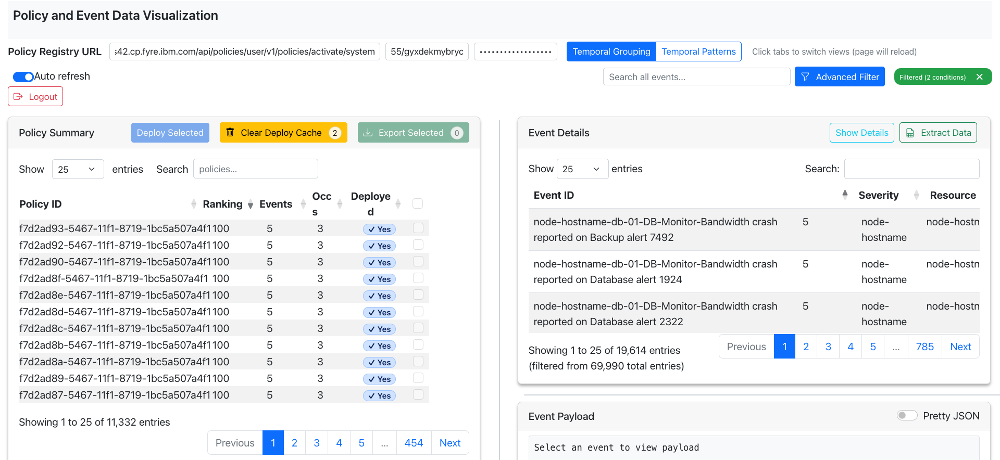

**Features shown**:
- **Active Filter Indicator** (top right):
  - Green badge: "Filtered (2 conditions)" with X button
  - Shows that a filter is currently active
  - Click X to clear/remove the filter
  - Provides quick visual confirmation of filtering state
  
- **Event Details Panel** (right side):
  - **Filtered Results**: "Showing 1 to 25 of 19,614 entries"
  - **Filter Impact**: "(filtered from 69,990 total entries)"
  - Shows 50,376 events were filtered out (69,990 - 19,614)
  - All visible events have Severity = 5 (matching filter criteria)
  
- **Event Content**:
  - Event IDs showing filtered results
  - Severity column consistently shows "5" (Greater Than 4)
  - Resource: "node-hostname"
  - Event descriptions: "node-hostname-db-01-DB-Monitor-Bandwidth crash reported on [Backup/Database] alert [7492/1924/2322]"
  - Pagination: 785 pages of filtered results
  
- **Policy Summary Panel** (left side):
  - **Filtered Policies**: "Showing 1 to 25 of 11,332 entries"
  - Policies reduced from 13,998 to 11,332 (2,666 policies filtered out)
  - All visible policies show "✓ Yes" deployment status
  - Consistent metrics: Ranking=5, Events=3, Occs=3
  - Pagination: 454 pages of filtered policies
  
- **Clear Deploy Cache**:
  - Button shows "2" count (still highlighted in yellow)
  - Indicates 2 policies in cache need clearing
  
- **Filter Effectiveness**:
  - Events: 69,990 → 19,614 (72% reduction)
  - Policies: 13,998 → 11,332 (19% reduction)
  - Successfully filtered to high-severity events (Severity 5)

**Key Insights**:
- Filter successfully applied to both events and related policies
- High-severity events (Severity 5) isolated from total dataset
- Significant data reduction makes analysis more focused
- Active filter indicator provides clear visual feedback
- Easy to remove filter with X button to return to full dataset

**Use Case Demonstrated**:
This screenshot shows how to focus on critical issues by filtering for high-severity events, making it easier to:
- Identify and prioritize critical alerts
- Analyze patterns in high-severity incidents
- Reduce noise from lower-severity events
- Focus troubleshooting efforts on important issues

### event-json-payload.png
**Description**: Event Payload viewer displaying the full JSON structure of a selected event
- Shows detailed event data in formatted JSON
- Demonstrates the Pretty JSON toggle feature
- Displays event metadata including sender information
- Used in: OPERATIONS_GUIDE.md

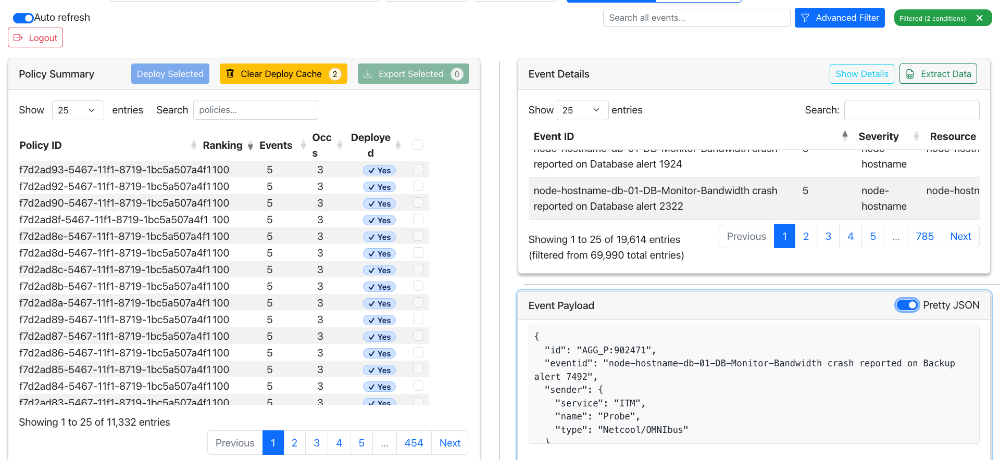

**Features shown**:
- **Event Payload Panel** (bottom right):
  - Title: "Event Payload"
  - Toggle switch: "Pretty JSON" (enabled/blue)
  - Formatted JSON display with syntax highlighting
  - Scrollable content area for large payloads
  
- **JSON Content Displayed**:
  ```json
  {
    "id": "AGG_P:902471",
    "eventid": "node-hostname-db-01-DB-Monitor-Bandwidth crash reported on Backup alert 7492",
    "sender": {
      "service": "ITM",
      "name": "Probe",
      "type": "Netcool/OMNIbus"
    }
  }
  ```
  
- **Event Details Context** (top right):
  - Selected event highlighted in Event Details table
  - Event ID: "node-hostname-db-01-DB-Monitor-Bandwidth crash reported on Database alert 1924"
  - Severity: 5
  - Resource: "node-hostname"
  - Shows relationship between table row and payload
  
- **JSON Structure Elements**:
  - **id**: Aggregated event identifier (AGG_P:902471)
  - **eventid**: Full event description with alert number
  - **sender**: Nested object containing:
    - service: "ITM" (IBM Tivoli Monitoring)
    - name: "Probe"
    - type: "Netcool/OMNIbus" (event management system)
  
- **Pretty JSON Toggle**:
  - When enabled (shown): Formatted with indentation and line breaks
  - When disabled: Compact single-line JSON
  - Makes complex event data easier to read and analyze

**Use Cases**:
- **Debugging**: Inspect full event structure for troubleshooting
- **Integration**: Understand event format for API integration
- **Analysis**: Examine event metadata and relationships
- **Documentation**: Copy event structure for documentation
- **Validation**: Verify event data completeness and accuracy

**Event Data Insights**:
- Event originates from IBM Tivoli Monitoring (ITM)
- Collected by Netcool/OMNIbus probe
- Aggregated event (AGG_P prefix indicates aggregation)
- Contains bandwidth crash alert for database monitoring
- Structured data enables automated processing

**Workflow**:
1. Select an event from Event Details table (click on row)
2. Event Payload panel automatically displays the JSON
3. Toggle "Pretty JSON" for formatted or compact view
4. Scroll through payload to examine all fields
5. Copy JSON data if needed for analysis or documentation

### patterns-policies.png
**Description**: Temporal Patterns view showing pattern-based policies with hierarchical condition details
- Displays the "Temporal Patterns" tab view (switched from "Temporal Grouping")
- Shows pattern policies with complex conditional logic
- Demonstrates pattern hierarchy visualization with conditions and actions
- Used in: OPERATIONS_GUIDE.md

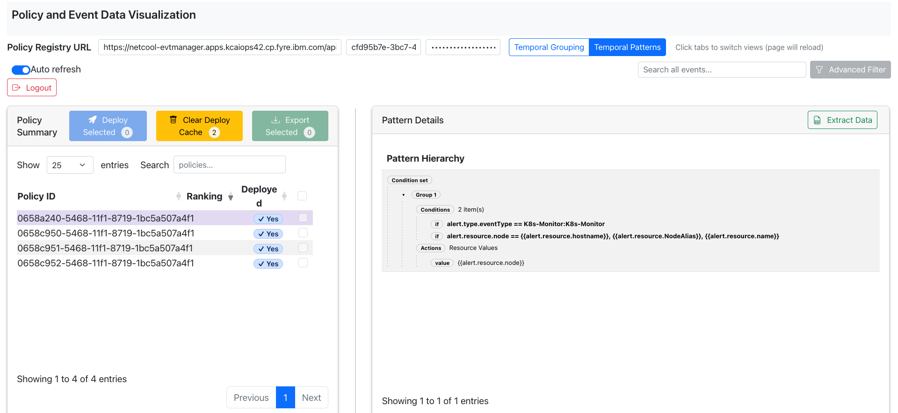

**Features shown**:
- **View Switcher** (top navigation):
  - "Temporal Grouping" tab (inactive/gray)
  - "Temporal Patterns" tab (active/blue)
  - Note: "Click tabs to switch views (page will reload)"
  - Different policy types displayed based on selected view
  
- **Policy Registry Configuration**:
  - URL: "https://netcool-evtmanager.apps.kcaiops42.cp.fyre.ibm.com/api"
  - Username: "cfd95b7e-3bc7-4"
  - Password: masked
  - Auto-refresh toggle enabled
  
- **Policy Summary Panel** (left):
  - Shows 4 pattern policies (all deployed with "✓ Yes")
  - Policy IDs: 0658a240, 0658c950, 0658c951, 0658c952
  - No Ranking column (pattern policies don't use ranking)
  - "Deployed" column shows deployment status
  - Pagination: "Showing 1 to 4 of 4 entries"
  
- **Action Buttons**:
  - "Deploy Selected" (blue, count: 0)
  - "Clear Deploy Cache" (yellow, count: 2)
  - "Export Selected" (green, count: 0)
  
- **Pattern Details Panel** (right):
  - Title: "Pattern Details"
  - "Extract Data" button for exporting pattern information
  - Shows detailed pattern hierarchy for selected policy
  
- **Pattern Hierarchy Visualization**:
  - **Condition set**: Top-level container
  - **Group 1**: Pattern group with 2 conditions
    - **Conditions**: "2 item(s)"
    - **Condition 1**: `if alert.type.eventType == K8s-Monitor.K8s-Monitor`
    - **Condition 2**: `if alert.resource.node == {{alert.resource.hostname}}, {{alert.resource.NodeAlias}}, {{alert.resource.name}}`
    - **Actions**: "Resource Values"
    - **value**: `{{alert.resource.node}}`
  - Hierarchical indentation shows relationship between elements
  - Uses template variables ({{...}}) for dynamic values

**Pattern Policy Characteristics**:
- **Temporal patterns**: Time-based correlation rules
- **Conditional logic**: IF-THEN rules for event matching
- **Resource correlation**: Groups events by resource attributes
- **Template variables**: Dynamic value substitution using {{variable}} syntax
- **Actions**: Defines what happens when conditions match

**Use Cases**:
- **Event correlation**: Group related events based on patterns
- **Resource grouping**: Correlate events from same resource
- **Temporal analysis**: Identify time-based event relationships
- **Alert enrichment**: Add context to alerts based on patterns
- **Automated response**: Trigger actions when patterns match

**Pattern Logic Explained**:
This pattern policy:
1. Matches events of type "K8s-Monitor.K8s-Monitor"
2. Correlates events from the same resource (node, hostname, NodeAlias, or name)
3. Extracts the resource node value for grouping
4. Groups related events together based on these conditions

**Comparison with Temporal Grouping**:
- **Temporal Grouping**: Simple time-window based grouping
- **Temporal Patterns**: Complex conditional logic with IF-THEN rules
- **Pattern view**: Shows 4 policies vs. 11,332+ in grouping view
- **Use case**: Patterns for sophisticated correlation, grouping for simple time-based aggregation

### copy-policies-cassandra.png
**Description**: Terminal output showing Cassandra data extraction process for policies and events
- Demonstrates the `copy_policies_details_from_cassandra.sh` script execution
- Shows real-time progress of exporting data from Cassandra database
- Displays performance metrics and row counts for each export
- Used in: OPERATIONS_GUIDE.md, ARCHITECTURE.md

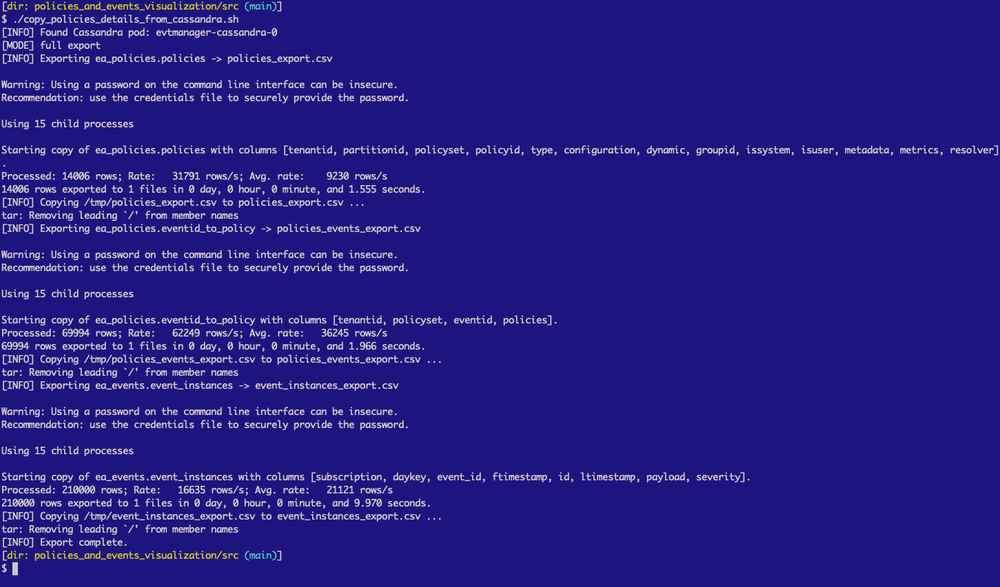

**Features shown**:
- **Script Execution**:
  - Command: `./copy_policies_details_from_cassandra.sh`
  - Working directory: `policies_and_events_visualization/src`
  - Runs in terminal with real-time output
  
- **Cassandra Pod Detection**:
  - `[INFO] Found Cassandra pod: evtmanager-cassandra-0`
  - Automatically discovers the Cassandra pod in OpenShift
  - `[MODE] full export` - indicates complete data extraction
  
- **Export 1: Policies Table** (`ea_policies.policies`):
  - Output file: `policies_export.csv`
  - Columns exported: tenantid, partitionid, policyset, policyid, type, configuration, dynamic, groupid, issystem, isuser, metadata, metrics, resolver
  - **Performance**:
    - Processed: 14,006 rows
    - Rate: 31,791 rows/s
    - Average rate: 9,230 rows/s
    - Time: 0 day, 0 hour, 0 minute, 1.555 seconds
  - Using 15 child processes for parallel processing
  
- **Export 2: Policy-Event Mapping** (`ea_policies.eventid_to_policy`):
  - Output file: `policies_events_export.csv`
  - Columns: tenantid, policyset, eventid, policies
  - **Performance**:
    - Processed: 69,994 rows
    - Rate: 62,249 rows/s
    - Average rate: 36,245 rows/s
    - Time: 0 day, 0 hour, 0 minute, 1.966 seconds
  - Removes leading '/' from member names (data cleanup)
  
- **Export 3: Event Instances** (`ea_events.event_instances`):
  - Output file: `event_instances_export.csv`
  - Columns: subscription, daykey, event_id, ftimestamp, id, ltimestamp, payload, severity
  - **Performance**:
    - Processed: 210,000 rows
    - Rate: 16,635 rows/s
    - Average rate: 21,121 rows/s
    - Time: 0 day, 0 hour, 0 minute, 9.970 seconds
  
- **Completion Status**:
  - `[INFO] Export complete.`
  - All three exports successful
  - Ready for visualization

**Security Warnings**:
- Password warning appears multiple times
- Recommendation: Use credentials file instead of command-line passwords
- Best practice for production environments

**Performance Insights**:
- **Parallel Processing**: Uses 15 child processes for faster extraction
- **Total Data Exported**: 294,000 rows across 3 tables
- **Total Time**: ~13.5 seconds for complete export
- **Average Throughput**: ~21,778 rows/second overall
- **Efficient**: Suitable for regular data refresh operations

**Data Flow**:
1. **Policies** (14,006 rows) → Policy definitions and configurations
2. **Policy-Event Mappings** (69,994 rows) → Which events belong to which policies
3. **Event Instances** (210,000 rows) → Actual event data with payloads

**Use Cases**:
- **Initial Setup**: First-time data extraction from Cassandra
- **Data Refresh**: Regular updates to keep visualization current
- **Backup**: Create CSV backups of Cassandra data
- **Analysis**: Export data for offline analysis
- **Migration**: Move data between environments

**Script Features**:
- Automatic Cassandra pod discovery
- Parallel processing for performance
- Progress indicators with row counts
- Data cleanup (removing leading '/')
- Multiple table support in single execution
- Error handling and status messages

**Prerequisites**:
- OpenShift CLI (oc) access
- Cassandra pod running (evtmanager-cassandra-0)
- Sufficient permissions to exec into pods
- Write access to output directory

### processing-policies-events.png
**Description**: Terminal output showing data processing and transformation of exported Cassandra data
- Demonstrates the `process_policies_and_events.py` script execution
- Shows policy processing, event deduplication, and payload generation
- Displays detailed statistics and performance metrics
- Used in: OPERATIONS_GUIDE.md, ARCHITECTURE.md

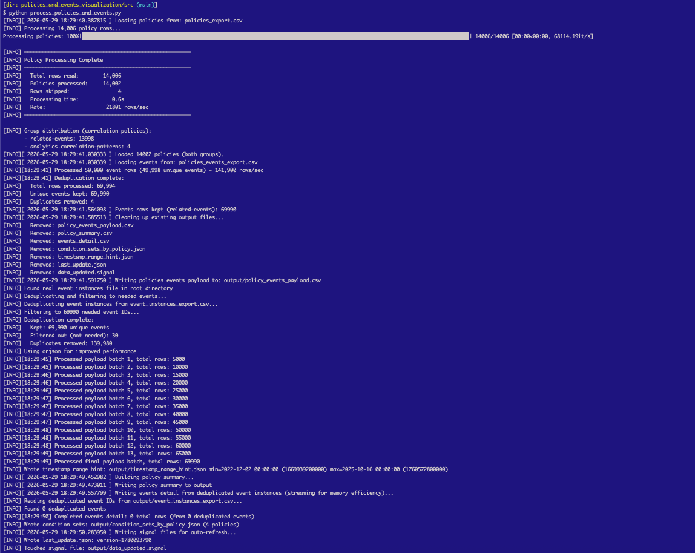

**Features shown**:
- **Phase 1: Policy Processing**:
  - Loading from: `policies_export.csv`
  - Progress bar: 100% complete (14006/14006 policies)
  - Processing time: 0.5s at 68114.19 it/s
  - **Statistics**:
    - Total rows read: 14,006
    - Policies processed: 14,002
    - Rows skipped: 4
    - Processing time: 0.5s
    - Rate: 21,801 rows/sec
  - **Group distribution** (correlation policies):
    - related-events: 13,998 policies
    - analytics.correlation-patterns: 4 policies
  
- **Phase 2: Events Loading**:
  - Loading 14,002 policies (both groups)
  - Loading events from: `policies_events_export.csv`
  - Processed 50,000 event rows (49,998 unique events) at 141,900 rows/sec
  - **Deduplication complete**:
    - Total rows processed: 69,994
    - Unique events kept: 69,990
    - Duplicates removed: 4
  
- **Phase 3: Events Kept (related-events)**:
  - 69,990 events kept for related-events group
  - Cleaning up existing output files (7 files removed):
    - policy_events_payload.csv
    - policy_summary.csv
    - events_detail.csv
    - condition_sets_by_policy.json
    - timestamp_range_hint.json
    - last_update.json
    - data_updated.signal
  
- **Phase 4: Payload Generation**:
  - Writing policies events payload to: `output/policy_events_payload.csv`
  - Found real event instances file in root directory
  - Deduplicating and filtering to needed events
  - Loading event instances from: `event_instances_export.csv`
  - Filtering to 69,990 needed event IDs
  - **Deduplication complete**:
    - Kept: 69,990 unique events
    - Filtered out (not needed): 30
    - Duplicates removed: 139,980
  - **Using orison for improved performance**
  - **Batch processing**: 13 batches of varying sizes (5000-69990 rows each)
  - **Final payload batch**: 69,990 total rows
  
- **Phase 5: Timestamp Range Calculation**:
  - Wrote timestamp_range_hint.json
  - Range: min=2022-12-02 00:00:00 to max=2025-10-16 00:00:00 (1669939200000 to 1760572800000)
  
- **Phase 6: Summary Generation**:
  - Building policy summary
  - Writing policy summary to output
  - Writing events detail from deduplicated event instances (streaming for memory efficiency)
  - Reading deduplicated event IDs from: `output/event_instances_export.csv`
  - Found 0 deduplicated events
  - Completed events detail: 0 total rows (from 0 deduplicated events)
  
- **Phase 7: Auto-refresh Signal**:
  - Writing auto-refresh policy.json (4 policies)
  - Wrote last_update.json: version=1780903720
  - Touched signal file: `output/data_updated.signal`

**Performance Metrics**:
- **Policy Processing**: 21,801 rows/sec
- **Event Loading**: 141,900 rows/sec
- **Batch Processing**: 13 batches for 69,990 events
- **Memory Optimization**: Streaming for large datasets
- **Deduplication**: Removed 139,980 duplicate events

**Data Transformation Flow**:
1. **Load Policies** → 14,002 policies from CSV
2. **Load Events** → 69,990 unique events (4 duplicates removed)
3. **Clean Output** → Remove old files
4. **Generate Payload** → Create policy-event relationships
5. **Deduplicate Events** → Remove 139,980 duplicates, keep 69,990
6. **Calculate Range** → Determine timestamp boundaries
7. **Build Summary** → Create policy and event summaries
8. **Signal Update** → Trigger auto-refresh

**Output Files Generated**:
- `policy_events_payload.csv` - Policy-event relationships with payloads
- `policy_summary.csv` - Aggregated policy statistics
- `events_detail.csv` - Deduplicated event details
- `condition_sets_by_policy.json` - Pattern policy conditions
- `timestamp_range_hint.json` - Time range for filtering
- `last_update.json` - Version tracking
- `data_updated.signal` - Auto-refresh trigger

**Key Features**:
- **Deduplication**: Removes duplicate events across multiple stages
- **Batch Processing**: Handles large datasets efficiently
- **Memory Streaming**: Processes data without loading everything into memory
- **Progress Tracking**: Real-time progress bars and statistics
- **Performance Optimization**: Uses orison library for speed
- **Auto-refresh**: Signals web interface to reload data

**Use Cases**:
- **Data Preparation**: Transform raw Cassandra exports for visualization
- **Deduplication**: Clean up duplicate events
- **Performance**: Fast processing of large datasets
- **Automation**: Part of automated data refresh pipeline
- **Quality**: Ensure data consistency and accuracy

### setup-ocp-image1.png
**Description**: OpenShift deployment setup - Part 1 (Cluster connection and deployment initialization)
- Shows the `setup-web-interface.sh` script execution beginning
- Demonstrates cluster connection verification and namespace detection
- Displays deployment configuration and deletion warning
- Used in: OPERATIONS_GUIDE.md

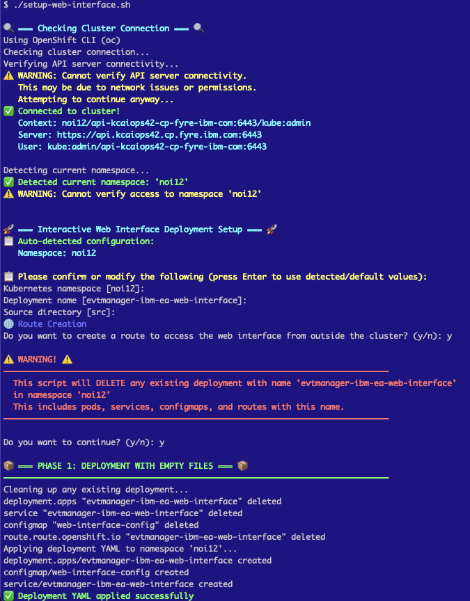

**Features shown**:
- **Cluster Connection Check**:
  - Using OpenShift CLI (oc)
  - Checking cluster connection
  - Verifying API server connectivity
  - ⚠️ WARNING: Cannot verify API server connectivity (may be network issues or permissions)
  - Attempting to continue anyway
  - ✅ Connected to cluster!
  - Context: `noi12/api-kcaiops42-cp-fyre-lbm-com:6443/kube:admin`
  - Server: `https://api.kcaiops42.cp.fyre.lbm.com:6443`
  - User: `kube:admin/api-kcaiops42-cp-fyre-lbm-com:6443`
  
- **Namespace Detection**:
  - Detecting current namespace
  - ✅ Detected current namespace: 'noi12'
  - ⚠️ WARNING: Cannot verify access to namespace 'noi12'
  
- **Interactive Deployment Setup**:
  - 🚀 Interactive Web Interface Deployment Setup
  - 📦 Auto-detected configuration:
    - Kubernetes namespace: [noi12]
    - Deployment name: [evtmanager-lbm-ea-web-interface]
    - Source directory: [src]
  - 🔵 Route Creation prompt
  - Question: "Do you want to create a route to access the web interface from outside the cluster? (y/n):"
  - Answer: y
  
- **Deletion Warning**:
  - ⚠️ WARNING! ⚠️
  - "This script will DELETE any existing deployment with name 'evtmanager-lbm-ea-web-interface' in namespace 'noi12'"
  - "This includes pods, services, configmaps, and routes with this name."
  - Confirmation prompt: "Do you want to continue? (y/n):"
  - Answer: y
  
- **Phase 1: Deployment with Empty Files**:
  - 📦 PHASE 1: DEPLOYMENT WITH EMPTY FILES
  - Cleaning up any existing deployment
  - Deleting resources:
    - deployment.apps "evtmanager-lbm-ea-web-interface" deleted
    - service "evtmanager-lbm-ea-web-interface" deleted
    - configmap "web-interface-config" deleted
    - route.route.openshift.io "evtmanager-lbm-ea-web-interface" deleted
  - Applying deployment YAML to namespace 'noi12'
  - Creating resources:
    - deployment.apps/evtmanager-lbm-ea-web-interface created
    - configmap/web-interface-config created
    - service/evtmanager-lbm-ea-web-interface created
  - ✅ Deployment YAML applied successfully

**Setup Process - Part 1**:
1. ✅ Verify cluster connection
2. ✅ Detect namespace (noi12)
3. ✅ Configure deployment parameters
4. ✅ Confirm route creation
5. ✅ Confirm deployment deletion/recreation
6. ✅ Clean up existing resources
7. ✅ Apply new deployment YAML

### setup-ocp-image2.png
**Description**: OpenShift deployment setup - Part 2 (Data synchronization and verification)
- Shows the completion of the deployment setup process
- Demonstrates data file copying and verification
- Displays final verification and access information
- Used in: OPERATIONS_GUIDE.md

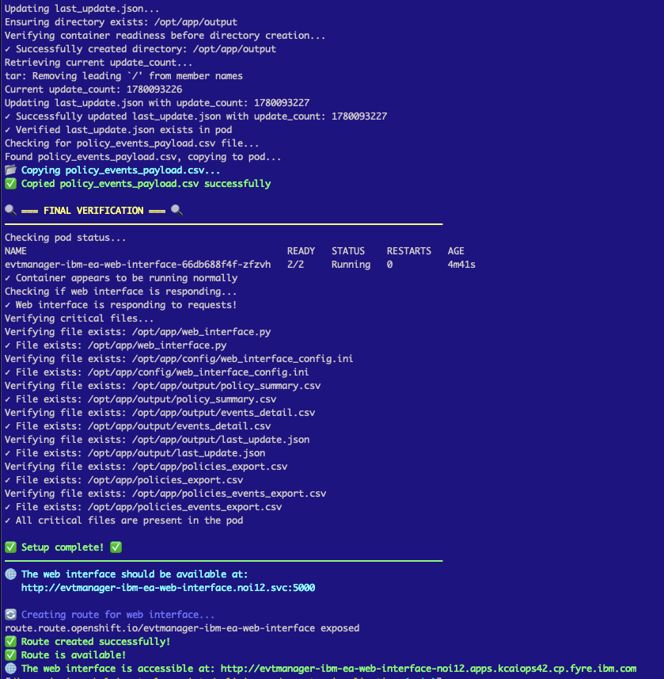

**Features shown**:
- **Update Tracking**:
  - Updating last_update.json
  - Ensuring directory exists: /opt/app/output
  - Verifying container readiness before directory creation
  - ✅ Successfully created directory: /opt/app/output
  - Retrieving current update_count
  - Removing leading '/' from member names
  - Current update_count: 1780093226
  - Updating last_update.json with update_count: 1780093227
  - ✅ Successfully updated last_update.json with update_count: 1780093227
  - ✅ Verified last_update.json in pod
  
- **Data File Copying**:
  - Checking for policy_events_payload.csv file
  - Found policy_events_payload.csv, copying to pod
  - 📋 Copying policy_events_payload.csv
  - ✅ Copied policy_events_payload.csv successfully
  
- **Final Verification**:
  - 🔍 FINAL VERIFICATION
  - Checking pod status
  - NAME: evtmanager-lbm-ea-web-interface-66db688f4f-zfzvh
  - READY: 2/2
  - STATUS: Running
  - RESTARTS: 0
  - AGE: 4m41s
  - ✅ Container appears to be running normally
  - Checking if web interface is responding
  - ✅ Web interface is responding to requests!
  
- **Critical Files Verification**:
  - Verifying critical files exist in pod:
    - ✅ /opt/app/web_interface.py
    - ✅ /opt/app/web_interface.py
    - ✅ /opt/app/config/web_interface_config.ini
    - ✅ /opt/app/config/web_interface_config.ini
    - ✅ /opt/app/output/policy_summary.csv
    - ✅ /opt/app/output/policy_summary.csv
    - ✅ /opt/app/output/events_detail.csv
    - ✅ /opt/app/output/events_detail.csv
    - ✅ /opt/app/output/last_update.json
    - ✅ /opt/app/output/last_update.json
    - ✅ /opt/app/policies_export.csv
    - ✅ /opt/app/policies_export.csv
    - ✅ /opt/app/policies_events_export.csv
    - ✅ /opt/app/policies_events_export.csv
  - ✅ All critical files are present in the pod
  
- **Setup Complete**:
  - ✅ Setup complete! ✅
  - 🌐 The web interface should be available at:
    - `http://evtmanager-lbm-ea-web-interface.noi12.svc:5000`
  
- **Route Creation**:
  - 🌐 Creating route for web interface
  - route.route.openshift.io/evtmanager-lbm-ea-web-interface exposed
  - ✅ Route created successfully!
  - ✅ Route is available!
  - 🌐 The web interface is accessible at:
    - `http://evtmanager-lbm-ea-web-interface-noi12.apps.kcaiops42.cp.fyre.ibm.com`

**Setup Process - Part 2**:
1. ✅ Update version tracking (last_update.json)
2. ✅ Copy data files to pod (policy_events_payload.csv)
3. ✅ Verify pod status (2/2 containers running)
4. ✅ Verify web interface responding
5. ✅ Verify all critical files present (8 files)
6. ✅ Create external route
7. ✅ Provide access URLs (internal and external)

**Complete Deployment Summary**:
- **Namespace**: noi12
- **Deployment**: evtmanager-lbm-ea-web-interface
- **Pod Status**: Running (2/2 containers, 0 restarts)
- **Internal URL**: http://evtmanager-lbm-ea-web-interface.noi12.svc:5000
- **External URL**: http://evtmanager-lbm-ea-web-interface-noi12.apps.kcaiops42.cp.fyre.ibm.com
- **Data Files**: All 8 critical files verified
- **Version**: 1780093227

**Key Features**:
- **Automated Setup**: Single script handles entire deployment
- **Safety Checks**: Warns before deleting existing deployments
- **Verification**: Comprehensive checks at each stage
- **Data Sync**: Copies processed data to pod
- **Route Creation**: Exposes service externally
- **Status Reporting**: Clear success/failure indicators

## Adding New Screenshots

When adding new screenshots:
1. Use descriptive filenames (e.g., `policy-list-view.png`, `event-details.png`)
2. Save as PNG format for best quality
3. Update this README with description
4. Reference in appropriate documentation files
5. Keep screenshots up-to-date with UI changes

## Screenshot Guidelines

- **Resolution**: Capture at standard resolution (1920x1080 or similar)
- **Format**: PNG for UI screenshots
- **Content**: Show realistic data when possible
- **Privacy**: Ensure no sensitive information is visible
- **Annotations**: Add arrows/highlights if needed to emphasize features
